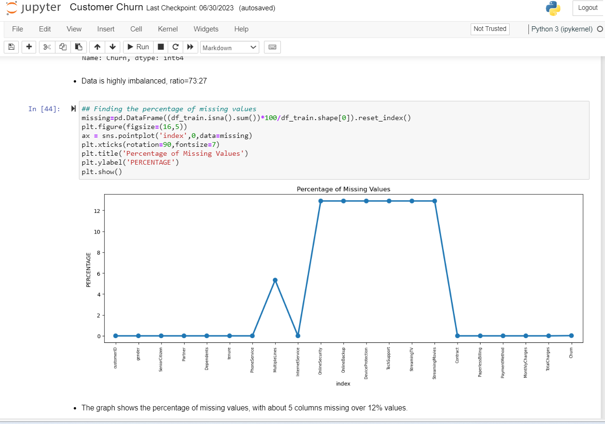
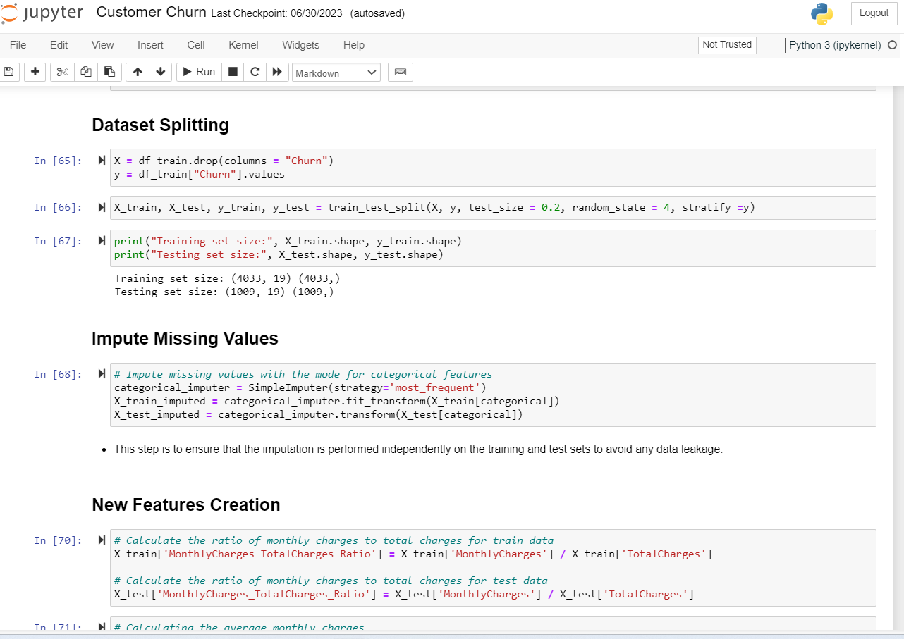
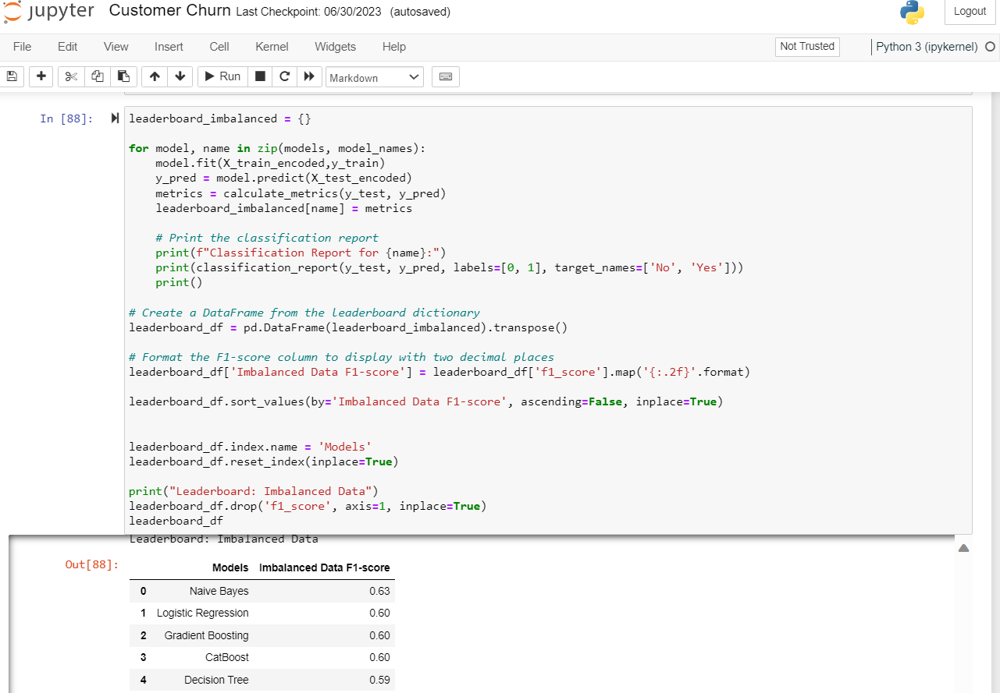

# Customer Churn Prediction with Supervised Machine Learning 📈 👍 👎

Welcome to the **Customer Churn Prediction** project, a Supervised Machine Learning endeavor focused on customer churn analysis and retention strategies. In this project, we diligently adhered to the Cross-Industry Standard Process for Data Mining (CRISP-DM) framework. By examining data variables and employing various techniques, we aim to predict and mitigate customer churn.

[](https://www.python.org/downloads/release/python-311/)


[](https://opensource.org/licenses/MIT)
[](https://jupyter.org/)


## Preview 🔍

<div style="display: flex; align-items: center;">
    <div style="flex: 33.33%; text-align: center;">
        <p>Top</p>
        
    </div>
    <div style="flex: 33.33%; text-align: center;">
        <p>Middle</p>
        
    </div>
    <div style="flex: 33.33%; text-align: center;">
        <p>Bottom</p>
        
    </div>
</div>

**Project Workflow:**

- **Data Collection:** Customer data was collected from various sources, including SQL Server tables and CSV/Excel files, covering demographics, services, payment, and churn status.
- **Data Processing:** Collected data was transformed into a suitable format using libraries like pyodbc and pandas, creating a comprehensive dataset.
- **Exploratory Data Analysis (EDA):** Extensive EDA was performed, including data summarization, handling missing values, and univariate and bivariate analyses, using pandas, numpy, matplotlib, and seaborn.
- **Data Preprocessing:** Data was cleaned, missing values handled, and categorical variables transformed, making it ready for in-depth analysis with pandas.
- **Hypothesis Testing:** Hypotheses on customer churn were formulated and tested using various statistical methods, including scipy's hypothesis tests.
- **Visual Insights:** Compelling visualizations were created to answer key questions about customer churn, using matplotlib and seaborn.
- **Power BI Deployment:** Analysis and visuals were deployed in Power BI for interactive exploration and sharing.
- **Data Balancing:** Class imbalance was addressed using the SMOTETomek technique.
- **Model Training and Evaluation:** Multiple machine learning models were trained, evaluated, and assessed, using classification reports with F1-score as the evaluation metric.
- **Model Fine-Tuning:** The best-performing model was fine-tuned as needed.
- **Advanced Model Improvement:** Hyperparameter tuning was performed for selected models using GridSearchCV.
- **Future Predictions:** The trained model can be deployed for ongoing predictions on new data, allowing proactive measures for customer retention.

## Setup 🚀

To run the code in this repository, ensure you have the following Python packages installed. You can install them using `pip`:

```bash
pip install pyodbc sqlalchemy lightgbm catboost python-dotenv pandas numpy matplotlib seaborn scipy
pip install scikit-learn xgboost
```

### Power BI Deployment 🌟 

We take our analysis to the next level with Power BI's Python scripting tool:

- Find the Power BI dashboard [Power BI](https://app.powerbi.com/view?r=eyJrIjoiYjkzMjc0NDUtNzEwMi00NTgzLWE3MGItYzQ1OTg3NjEwNjcwIiwidCI6IjQ0ODdiNTJmLWYxMTgtNDgzMC1iNDlkLTNjMjk4Y2I3MTA3NSJ9)
- Discover Python integration with Power BI [here](https://learn.microsoft.com/en-us/power-bi/connect-data/desktop-python-visuals)

## Author 👨‍💼

| Name | Article Link | Github |
| ---- | ------------ | ------ |
|Israel Anaba Ayamga      |[Defying Telco Churn: Leveraging Machine Learning for Customer Retention Success](https://israelanaba.medium.com/defying-telco-churn-leveraging-machine-learning-for-customer-retention-success-4e535b946ca0)              |[Israel_Anaba](https://github.com/Israel-Anaba)        |
|      |              |        |

## 📝 License

This project is licensed under the [MIT License](LICENSE).

## 🤝 Contributing

Contributions are welcome! Feel free to open an issue or submit a pull request.

## Acknowledgements 🙏

I would like to express my gratitude to the [Azubi Africa Data Analyst Program](https://www.azubiafrica.org/data-analytics) for their support and for offering valuable projects as part of this program. Not forgeting my scrum masters on this project [Rachel Appiah-Kubi](https://www.linkedin.com/in/racheal-appiah-kubi/) & [Emmanuel Koupoh](https://github.com/eaedk)

## 📧 Contact

For questions or feedback, please contact [Israel Anaba Ayamga](officicalanaba@gmail.com).


